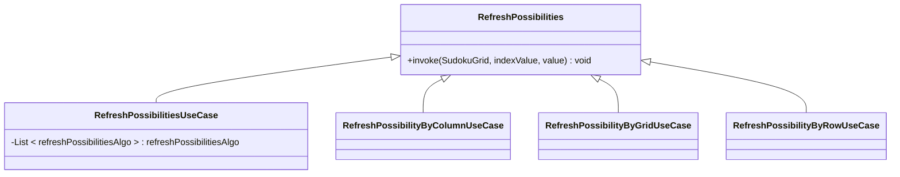

# PuzzleGame

Playing this game "puzzle page" on my android device.
I decide to create this project to code the algorithm to resolve these games:

-Sudoku (WIP)

-Armada

-Charge up

## Stacks

UI : Compose

Architecture : MVVM, Clean architecture

Design pattern : Composite, Chain of responsibility

DI: Hilt

## Suduko

I set up the clean architecture with a repository to get a list of sudoku (in a mock) and a sudoku with its id.

### UseCase refresh possibilities 
I apply the composite pattern to refresh the sudoku every time I find a value

refreshPossibilitiesAlgo is a list of RefreshPossibilityByColumnUseCase, RefreshPossibilityByGridUseCase & RefreshPossibilityByRowUseCase

So every time, I fill a cell with a value, I will call RefreshPossibilitiesUseCase to refresh the possible values in the grid, row & column.

### UseCase resolver

I apply the chain of responsibility pattern to execute the algorithm with a specific order to find the next value or "clean" the possible values.

